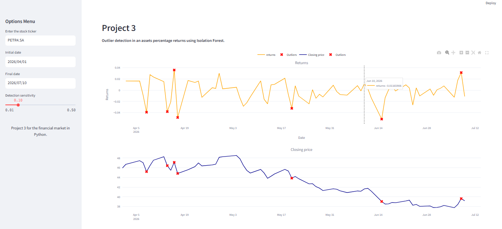

Today,

I am bringing a tool that is very useful in quantitative analysis: Isolation Forest. What is Isolation Forest ? In general terms, it is a tool for identifying outliers in a dataset. It is right to say that Isolation Forest is an unsupervised machine learning algorithm. SO, the application for this algorithm is simple. Considering a dataset, or in our case, a ticker time series, it is possible to find the outliers, and these outliers can be good opportunities to buy or sell the ticker. 

Furthermore, the isolation forest has a level of sensitivity (Detection Sensitivity) that, in a few words, represents the portion of the data that are outliers; the higher the sensitivity, the more points will be considered outliers. For example, I have 100 observations, and my Detection Sensitivity is 0.15, so I will have 15 observations as outliers. If it decreases the value to 0.05, it means that only 5 observations will be outliers. So the level of detection sensitivity requires parsimony, and it is suggested to try to find the best model for you.   

